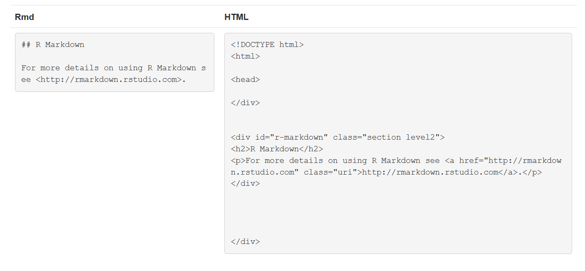
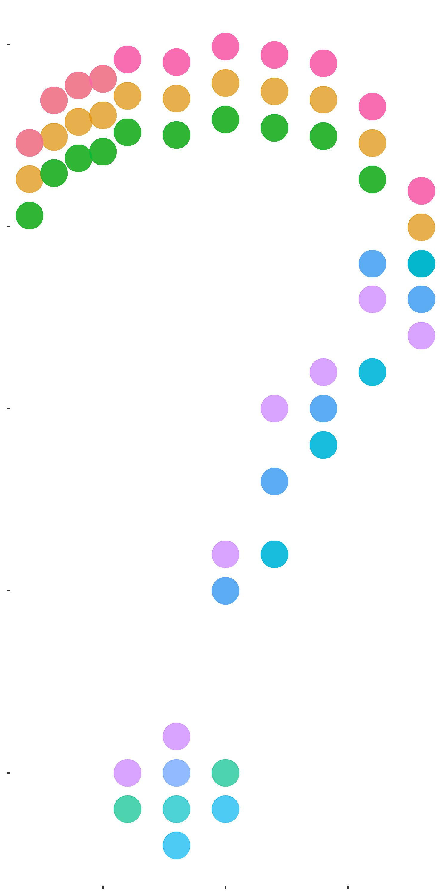

<!-- You can use the title field above and have it as your opening slide, but in this case it
is not possible to add images, as far as I know. My workaround was to have a blank title and use a markdown line instead (line below). -->

# Introduction to R Markdown 

##

***

# Objectives

- Understand what RMarkdown is and why you should use it
- Learn the basic components of R Markdown
- Learn how to create an RMarkdown file 
- Export an RMarkdown file into many file formats
- Understand the value of writing reproducible reports
- Become familiar with R code chunks, and understand their purpose, structure and options 
- Become familiar with Markdown language
- Learn about R Notebook

***

## What is Markdown?

{ width=40% }

>- A plain text formatting syntax
>- Like HTML, but easier to write and read
>- Can be written in any text editor
>-Some text editors can render Markdown documents, but these documents are still readable if you can't render them.
>- Markdown files can be converted to HTML

##  

## Why Use Markdown instead of Microsoft Office?


>- Markdown is more flexible. You can create websites, documents, notes, books, presentations, email messages, and technical documentation.

>- Markdown files can be opened using virtually any application (including MS Word). 

>- Markdown is platform independent. You can create Markdown-formatted text on any device running any operating system.


## What is R Markdown? 

>- A single medium for writing code and generating reports. 
>- Creates fully reproducible documents 
>- Supports dozens of static and dynamic output formats including HTML, PDF, and MS Word
>- Uses multiple languages including R, Python, and SQL.

##


## 


<!-- here you write a comment -->


# You can share your reports...

## With Code

```{r include=FALSE}
library('gapminder')
library(reshape2)
library(ggplot2)
library(cowplot)
```


```{r echo=TRUE, fig.height=4, fig.width=4}

ggplot(
  subset(gapminder, continent != "Oceania"),
  aes(
    x = year,
    y = lifeExp,
    group = country,
    color = country
  )
) +
  geom_line(lwd = 1, show.legend = FALSE) + facet_wrap( ~ continent) +
  scale_color_manual(values = country_colors) +
  theme_bw() + theme(strip.text = element_text(size = rel(1.3)))

```


## Or without it

{ width=30% }


## Let's try!


```{r include=FALSE}
library(ggplot2)
gaptest <-
  read.table("GapTest.txt", header = TRUE, check.names = FALSE)
gaptest
gaptest1 <- reshape2::melt(gaptest, id.vars = "Year")
p <- ggplot(gaptest1, aes(x = Year, y = value, colour = variable)) +
  geom_point(alpha = 0.7, size = 10)  +

  theme(
    legend.position = "none",
    # axis.text.x = element_blank(),
    # axis.title.x = element_blank(),
    # axis.text.y = element_blank(),
    # axis.title.y = element_blank(),
    panel.background = element_rect(fill = "transparent"),
    plot.background = element_rect(fill = "transparent", color = NA)
  )

p + labs(caption = "Created by Viviane Girardin in R", title = "Interpreting data")


#save_plot("QMark.jpg", p, base_height = 10, base_width = 5)

```

