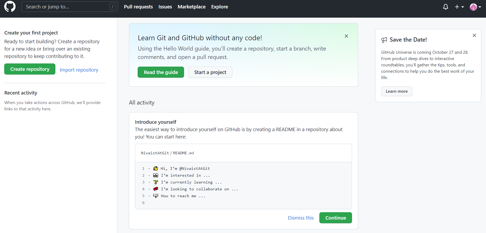

## Account Setup and Configuration

* The first thing you need to do is set up a free user account. Visit https://github.com. Provide an email address and click the big green 
<kbd>Sign up for GitHub</kbd> button.

* Then follow the instructions to create a password and username. **When choosing an username, we highly recommend you take a look at the [Chapter 4 (Register a GitHub account)](https://happygitwithr.com/github-acct.html) of Jenny Bryan’s [Happy Git and GitHub for the useR (happygitwithr.com)](happygitwithr.com).**
After a couple of extra steps you will create an account.

* In the next step you will get the following page: 

* You can skip the questions and go directly to **`Continue`** On the next page you can choose
**`Collaborative coding`**.
 

* Next choose the free version. Annnnd... **voilà! You now have a Github account!**

## Installing Git

* To install most programs at your NIVA computer you need administrative rights. To get this rights you need contact it-vakt (it-vakt@niva.no) and ask for adminstrative rights to your computer. You will shortly get an email with the username and password you need for installation. Then please follow the instructions on [Chapter 6 Install Git]( https://happygitwithr.com/install-git.html) of Jenny Bryan’s [Happy Git and GitHub for the useR (happygitwithr.com)](happygitwithr.com).