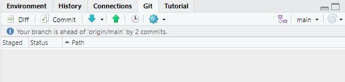
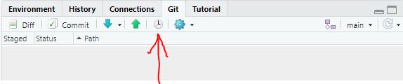

## Starting a new project    

Follow the description in chapter 15.1 and 15.2 of Jenny Bryans's guide: [New project, GitHub first](https://happygitwithr.com/new-github-first.html).  
  
In short:   

* Go to https://github.com and make sure you are logged in  
* Click green “New repository” button   
* Set  
    - Repository name: myrepo (or whatever you wish)  
    - Public   
    - set YES on 'Initialize this repository with a README'  
    - Click the big green button “Create repository.”
   
This opens a new Github repo. Next thing to do:   

- Copy the HTTPS clone URL to your clipboard via the green “Clone or Download” button.  
    
Then, go to RStudio and start a new Github project:      

- File > New Project > Version Control > Git  
- You will see this window:  
   

- In the top box, “repository URL” paste the URL of your new GitHub repository. It will be something like this https://github.com/jennybc/myrepo.git (see figure below)  
- In the bottom box 'Create project as subdirectory of', select the folder you want (i.e.,: be intentional about where you create this Project).  
- Suggest you “Open in new session”   
- Click “Create Project” to create a new directory, which will be all of these things:  
    - **a directory or “folder” on your computer**  
    - **a Git repository, linked to a remote GitHub repository**    
    - **an RStudio Project**  

## Your first commit    

Now you hopefully have a **Git pane** in the upper right of RStudio. Here you will see the following:  
  

- You will see two files that are automatically made my RStudio when you created the project (don't worry about the content of these files)  
- The yellow question mark symbols means that these are new files that Git does not "follow". Git will not be "aware" of any changes in these files
    
Now check both boxes to the left of the files:  
  

- The icons will change to a green "A" icon, meaning that the file has now been "added" to Git's index and **staged** for commit. From now on, Git will be "aware" of any changes in these files as soon as the files are changed.  
     
       
Now click the "Commit" button. The following window will open:  


- except that the top right window will be blank. Here you need to fill in a **commit message** in line number 1. Write a short (but informative) commit message (keep it to only one line). If you want to write more extensive comments, keep     line number 2 blank, and write your comments from line number 3 onwards (as we have done above).    
- Click "Commit"  
- A small window will open with a short (but cryptic) message telling you that your file was committed  
- Close the small window and the bigger commit window  
  
Now the Git pan is again empty, meaning that the local Git repository is in sync with your "workspace" (your files in the project folder).  

## Adding a script  

Start a new R Markdown file by selecting (in the RStudio menu)   

* File   
* -> New file  
* -> R Markdown   
    - In "title", put for instance "Git training"  
  
This will open a sample markdown file which suits our purposes - just keep it as it is, for now. 

* Save the file with a short name, for instance `myscript.Rmd` (RStudio will automatically add `.Rmd` to the name).  
  
Now this file pops up in the Git pane, with yellow question marks, indicating that this file is not tracked by Git.  

Stage and commit the file:   


## Pushing to Github (+ checking history)  

### Check local vs remote repository   

After your last change, the Git pane is again empty, indicating that your files and your local repo are the same. However, the pane has the following message: "Your branch is ahead of 'origin/main' by 2 commits':  
  

- This means that although the *local* Git repo is in sync with your files (the Git pane is empty), the *remote* repo (i.e., Github) is *not* in sync with your local repo - there are two changes in the local repository that have not been pushed to Github.  
  
We can also see this in the history. Click the "history" button:  

  
This looks as this:  

- In the top part, the two blue marks with `origin/main` and `origin/HEAD`  shows that tGithub is still at the first commit (which was made when you created the repo in Github), while the green "HEAD" at the top shows where "you" are in the local repository - on the last change.  
- The bottom part shows the "name" of the commit (the **SHA**), the commit message, and the change itself (here, the entire file is shown in green because everything is new)

### Github token  

When pushing, you will be asked for your Github username and a password. Your ordinary Github password won't do - you need to use a **token** from Github. If you are logged into Github on your browser, you will find it at [github.com/settings/tokens](https://github.com/settings/tokens). As that page says, you need to copy-paste it to somewhere else (a text file, Google Document etc.) and save it there. From there, you can copy-paste it to RStudio when you need it.  
  
To avoid copy-pasting the token when you need it, you can store it on your computer as this:  
```
# install.packages("gitcreds")
library(gitcreds)
gitcreds_set()
```
- this will give you the choices:  
    1. Keep these credentials  
    2: Replace these credentials  
    3: See the password / token  
- choose 2 and copy-pasted in your token  
- Note: It does say "Removing current credentials…", but your 'old-fashioned' password still works when logging into Github in the browser   

### Push to Github

The pushing itself is very easy - just click this button:  
  

- If you have not you credentials stored in R, you will be asked for username and password (token)  
- A small window will open with a message that you have push your changes to Github (well, that's not what it literally says, but that's what it means)
- Close this small window  
- So, now the remote repository (Github) has been updated with the current contents of your local repository  

Now check the history again:  
  
- Note that both the blue and green 'bubbles' now are on the last commit  
- This means that your local repository (on your hard disk) and remote repository (Github) are in sync  
- You may also check in Github and confirm that our files are showing up there (might have to push F5 to update)  
- Normally, we push only a few times per day, perhaps only once   

## The basic routine: edit, save, stage and commit    

Now we want to do some changes to our script. Add "col = 'red'" to the plot in the last chunk (and run the chunk again if you want):    
```
# CHANGE NUMBER 1
plot(pressure, col = "red")
```
(the `CHANGE NUMBER 1` comment beforeis just for this exercise, to make it easier to keep track of our changes.)
* Save the file (Control + S)   

The file now pops up in the Git window again, this time with a blue 'M' (for 'modified'):  

  

Stage the file (check the checkbox) and commit with a suitable message:     
  
    
## Amending your commit  
After you have committed, you might find out that you actually committed a little early - you want to add some changes that 'belong to' the commit you just performed. This is very easy. For instance, you have just added and commited the change `col = "red"` but you find out that you want to explain why you did this. So in the script you simply do the change you want - in this case, adding the comment `# because red is such a nice colour`  -  save, stage, and click the 'commit' button. Then you check the "Amend" checkbox:     
  
- this brings up your previous commit message (you can modify the message too if you want)  
- now click commit, and your extra comment has been added to the previous commit, instead of becoming a tiny commit in itself    
- you can even use 'repeated amending' [as a conscious strategy](https://happygitwithr.com/repeated-amend.html)  

## Make a web page from your Rmd script  
**TODO**


## Undoing things  
Undoing in Git depends a lot of whether you have only saved the file, saved and commited, or saved, committed and pushed   

### Undo your last edits (before committing)  

* Use case: the cat walked over the computer keyboard, and even managed to save the file     
* Make some messy chnages in your file and save (but don't commit)    
* Right-click the file and select "Reset"   
    - in git command language, this button runs `git checkout HEAD  as reset is a part command   

### Undo (some of) your last edits (after committing, but befor pushing)  

* As above, make some (nonsensical) changes, save, stage and commit (but don't push)     
* In the *terminal pane*, write the following:  
```
git reset --soft HEAD~1
```
(On Windows you use the `^` sign, on Linux (and Mac?) use `~`)  
* HEAD~1 refers to the state before your last commit ('one commit back')  
* Then, click the Update button in the Git pane (all the way to the right)  
* Then, mark the file and click the Commit button     
* Now you can first **unstage** some or all of your changes:  
  
* - and then you also need to **discard** these changes   
  

Your script will now return to the old state!  
- If you are really sure you want to throw your last changes overboard, replace `soft` by `hard`. Then you will not get the chance to review which changes you are deleting, though  
    - however, if you really regret a hard reset, you can use git reflog - see [here](https://github.blog/2015-06-08-how-to-undo-almost-anything-with-git/) 

### Undo your last edit after committing *and* pushing     

* Make some (nonsensical) changes as before, save, stage and commit, AND push       
* In the *terminal pane*, write the following:  
```
git revert HEAD~0
```
* `git revert` makes a new commit that is the opposite of your last commit  
* Your file should now change back  
* Also, your default text editor (e.g. Notepad) should open with a suggested commit message - you can just close this window (or you can change the commit message first if you like)  
* The Git Pane is empty, showing that your files and your *local* repo is in sync     
* This is a preferable way to undo changes that has been "published" on Github, as it doesn't change the history of changes (which cold potentially make a mess for other people). Instead, it just adds another change that turns the file back to what it used to be.   

  
In the history, you can see both changes:  

<br>
Your last commit ("change 10 aquamarine") shows that the parts in red were replaced with the parts in green, so the commit changed `col = "black"` to `col = "aquamarine`:   
  

<br><br>
The `git revert`command above made the last commit, changing the plot color back. The diff of this commit (i.e. the green/red markings on the script) is just reversed from the commit above:     


### Undo a bunch of edits after pushing     

* In the history, you see each commit referred to with a SHA code. You can use these to go as far back in your history as you want:       
```
git revert 53A34
```

- You should pick the line *above* the version you need in the history - you will get the last version before you did commit 53A34   
- You usually have to write just the first 5 characters of the SHA  
  
However, when you go far back in history will usually result in a *merge conflict*. That means that Git isn't sure of exactly which parts you want from your last version, and which edits you want from the version indicated by the SHA. This is Git's message:    
  

<br>

In the script window, Git will have inserted some stuff:  
  

* This means :  
    - a line with `<<<<<<< HEAD`  (HEAD is 'where you were' when you performed the merge)    
    - the code of your last version    
    - a line with `=======` separating last and old version   
    - the code in the old version  
    - a line with `>>>>>>> branch-person-B`    

<br>
Now, simply edit the script, i.e. just keep the parts you want and delete the parts you don't want, including the lines starting with `<<<<<<<`, `=========`  and `>>>>>>>>>`:   

  

- Then save, stage (click the checkbox) and merge the ordinary way  
- As above, your previous history will still be there, so whatever you do here, it's not irreversible  

## Pulling your colleague's changes   


### Merge automatically  
**TODO**  
- Make a change in R and commit, and make a change in the same file but in a different place, on Github  
- Push from R - you are not allowed
- Pull, "fast-forward" merge -> no problem    
- Push from R again

### Merge with conflict    
**TODO, but can use stuff from branch chapter**  
- Make another change in R and commit, and then make make a change in the same file but in a different place, on Github  
- Push from R - you are not allowed
- Pull -> merge conflict  
- Solve conflict and commit
- Push from R again


## How to check an earlier version  
**TODO**  
- Check in Github  
- checkout in R  

## Branching and merging (skip??) 

### Create a new branch  

Branching is a central concept of git. If you work alone, it is a useful way to try  "experimental" coding in your script, while still keeping the original script intact. If you work with others, two or more people can work in parallell on the same project or even in the same script, and then everybody's changes can be merged afterwards. (Don't confuse 'branch' with 'fork', which is a slightly different concept).   

* Click on the branching tool, which is in the Git menu bar, just to the left of where it says 'master'  
* Call the new branch "car-analysis", leave the rest as it is and click "Create"  
* Now note that where it used to say "master", it now says "car-analysis". This means that you are now on the new branch that you have created   
    - in Git-speak, HEAD is on the new branch   
    - this means that when you change 
* Now change the second chunk in your script so you get a plot instead of summary:   
```
plot(cars)
```
* Save, stage (check box) and commit with some message  
* Now check the history by clicking the little clock on on the Git menu bar    
    - The first line says has a coloured box saying that you (HEAD) are on the "car-analysis" branch, and then gives your last commit message  
    - The second line has two coloured boxes: one says "origin/car-analysis" (meaning: this is where we started the car-analysis branch), the other says "main" (meaning that nothing has happened to the main branch since we started the car-analysis branch)  

### Make changes in the old branch as well  

* Change back to the main branch   
    - Click "car-analysis" in the Git menu bar and change to "main" under "local branches" (meaning your computer)   
* Note what happened to the script file in your editor - we are back to `summary(cars)`!    
* Now change the color of the "pressure" plot to "blue"  
* Save, stage and commit  
* Check the history again. In the top of the history window, click "main" and switch to "all branches"   
* Note: you can change back and forth between the branches as much as you like, and make changes to both of them  

### Merge the changes in the new branch back to the old branch  
* Make sure you are on 'main' (check the right part of the GIt menu bar)  
* Go to either  
    * The 'terminal' pane in RStudio's bottom left quadrant  
    * Or select 'Shell' from the "cogwheel" symbol in the Git menu bar  
* Give the command ```git status``` (and push enter) - it should say 'on branch main' and 'nothing to commit, working tree clean'  
* Then merge using the command      
```
git merge car-analysis
```
* Check the history (remember to select "all branches") - it now shows both merges and that the branches have merged   
* As the changes were two different places in the script, Git was able to include both chnages in the new document  
* The history shows both 'main' and 'car-analysis' at HEAD   
* We may want to delete the 'car-analysis' branch since we are finished using it, an it just points to the same location as main   
   - The command for this is `git branch -d car-analysis`    
   - However, Git doesn't want to do that, as it says that 'car-analysis' is not fully merged. The message says something about 'remote', so we      
   - We need to push both branches to Github first. The simplest way to do this is using the command `git push --all origin`.  
   - (Alternatively you can use the RStudio Git interface to push main, then switch to 'car-analysis' and push that too.)    
   - Then switch back to main and repeat `git branch -d car-analysis`.

### Git merge with conflict   

In the example above, the branches 'main' and 'car-analysis' made changes in two different parts of the document, so Git was able to include both changes in the merged script. If the two branches contain edits in the same parts (lines) of the script - typically if persons A and B don't know that they work on the same part - a **merge conflict** will result. Git cannot decide which changes should be retained - you have to decide that. 
  
We will make such a situation and then solve it.       

* Create a new branch, e.g. 'branch-person-B'    
* Change the color of the 'pressure' plot to 'purple'. Save, stage and commit.    
* Switch to branch main (click on the branch name in the Git menu bar)    
* Change the color of the 'pressure' plot to 'brown'. Save, stage and commit. 
* Check the history (remember to select "all branches").  
* Now, merge (`git merge branch-person-B`)  
* This did not go smoothly, as indicated by the text "merge conflict in myscript.Rmd" in the command window, and two orange "U" icons next to the file in the Git tab   
* Now check how the script in your editor looks like. Git has put some extra stuff in your file:  
    - a line with `<<<<<<< HEAD`  (HOME is where we performed the merge from, i.e. 'main' in this case)    
    - the code in the 'main' branch (`col = "brown"`)  
    - a line with `=======`  
    - the code in the 'branch-person-B' branch (`col = "purple"`)   
    - a line with `>>>>>>> branch-person-B`    
* Now you simply edit the file, i.e. just delete either the line with 'brown' or the line with 'purple'. The lines starting with `<<<<<<<`, `=========`  and `>>>>>>>>>` can just be deleted.  
* Save, stage (click the checkbox) and merge the ordinary way  
  
Now, everything is ok again!  


  

