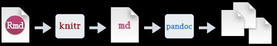
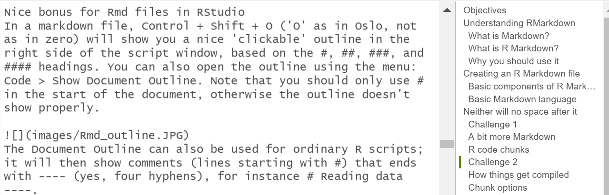

***

<style>
div.blue { background-color:#DBE1E5; border-radius: 5px; padding: 20px;}
</style>
<div class = "blue">
# Objectives

- Understand what R Markdown is and why you should use it
- Learn the basic components of R Markdown
- Learn how to create an R Markdown file 
- Export an R Markdown file into many file formats
- Become familiar with R code chunks, and understand their purpose, structure and options 
- Become familiar with Markdown language
- Learn about R Notebook
</div>
***


```{r global_options, echo=FALSE, warning= FALSE}
knitr::opts_chunk$set(warning=FALSE)
```

<ul class="pager"> <!--this is the style of the button-->
<li><a href="#">Table of contents</a></li> <!--This button takes me to previous page-->
</ul>


# Understanding RMarkdown

## What is Markdown?


* A plain text formatting syntax

  * Like HTML, but easier to write and read
  * Can be written in any text editor. 
  * Some text editors can render Markdown documents, but these documents are still readable if you can't render them.
    
<p></p>

* Markdown files can be converted to HTML

    * Markdown is a system for writing web pages by marking up the text. The marked-up
text gets _converted_ to html, replacing the marks with the proper
html code.

## What is R Markdown? 

* R Markdown is a file format for making dynamic documents with R.

*	R Markdown is written in an Rmd file (which is just a text file, but RStudio shows scripts with .Rmd extension in a special way). When you hit the "knit" or "preview" button in RStudio, the process below (involving both knitr and pandoc) automatically turns your Rmd file into a HTML page which opens in your browser.

* `knitr` allows you to mix basically any type of text with code from different programming languages, but we recommend that you use `R Markdown`, which mixes Markdown
with R. [Markdown](https://www.markdownguide.org/) is a light-weight mark-up language for creating web
pages.

* Pandoc is a free and open-source document converter




## Why you should use it

* Writing long reports with Word can become easily frustrating when you need to format figures or page breaks.
Creating a web page (as an html file) using R Markdown makes things easier.

* Additionally, the formatting of and R Markdown document is simple and easy to modify, allowing you to spend
more time on your analyses instead of writing reports.

* Ideally, as an analysis you would run in a lab, you want your documents to be _reproducible_: If an
error is discovered, or if some additional subjects are added to the
data, you can just re-compile the report and get the new or corrected
results rather than having to reconstruct figures, paste them into
a Word document, and hand-edit various detailed results.

* Finally, if you use Git and Github, it is easy to share your final report - containing both your code and resulting tables and figures - as a web page on the Github for easy viewing by everybody in your organization (or everybody in the world).


<ul class="pager"> 
<li><a href="#">Table of contents</a></li> 
</ul>

# Creating an R Markdown file

Before we create our R Markdown document, let's create a project:

Within RStudio, go to File &rarr; New Project &rarr; New Directory &rarr; New Project. Then choose the directory name (this will be the name of the file in your computer and the name of your project), and where you want to save it. Then click on **`Create Project`**.


To create an R Markdown file click on **File &rarr; New File &rarr; R Markdown** and
you'll get a dialog box like this:

***


***

Stick with the default (HTML output), as you will learn that it is very easy to change it to another format later. Remember to give a title (this can also be easily changed later in your document).

<ul class="pager"> <!--this is the style of the button-->
<li><a href="#">Table of contents</a></li> 
</ul>

## Basic components of R Markdown

The initial chunk of text (header) contains instructions for R to specify what kind of document will be created, and the options chosen. You can use the header to give your document a title, author, date, and tell it what type of output you want to produce. In this case, we're creating an html document.

```
---
title: "Initial R Markdown document"
author: "VIG and DHJ"
date: "22.09.2020"
output: html_document
---
```

You can delete any of those fields if you don't want them
included. The double-quotes aren't strictly _necessary_ in this case.
They're mostly needed if you want to include a colon (`:`) in the title.

RStudio creates the document with some example text to get you
started. Note below that there are chunks like

<pre>
&#96;&#96;&#96;{r}
knitr::opts_chunk$set(warning = FALSE)
&#96;&#96;&#96;
</pre>

These are chunks of R code that will be executed by `knitr` and replaced
by their results. More on this later.


<ul class="pager"> 
<li><a href="#">Table of contents</a></li>

## Basic Markdown language


For now, let's delete all of the stuff that's there and write a bit of
markdown.

To create headers, you use `#`: 

```
# Header 1
## Header 2
### Header 3...
```

Note that there is no space before the hashtag, but a space after is required.

 # A space before the hashtag will not not work
 
#Neither will no space after it

You make things **bold** using two asterisks, like this: `**bold**`,
and you make things _italics_ by using underscores, like this:
`_italics_`.

You can make a bulleted list by writing a list with hyphens or
asterisks, like this:

```
* bold with double-asterisks
* italics with underscores
* code-type font with backticks
```

or like this:

```
- bold with double-asterisks
- italics with underscores
- code-type font with backticks
```

Each will appear as:

- bold with double-asterisks
- italics with underscores
- code-type font with backticks

You can use whatever method you prefer, but *be consistent*. This maintains the
readability of your code.

You can make a numbered list by just using numbers. You can even use the
same number over and over if you want:

```
1. bold with double-asterisks
1. italics with underscores
1. code-type font with backticks
```

This will appear as:

1. bold with double-asterisks
1. italics with underscores
1. code-type font with backticks

Create sub-bullets, by clicling on <kbd>tab</kbd> followed by your sub-bullet, like this:
```
- bullet
  - sub-bullet 1
  - sub-bullet 2
- Next bullet 

```

That will result in the following:

- bullet
  - sub-bullet 1
  - sub-bullet 2
- Next bullet 

You _compile_ the R Markdown document to an html webpage by clicking
the "Knit" button in the upper-left.

### Challenge 1

 1. Create a new R Markdown document. Delete all of the R code chunks
 and write a bit of Markdown (some sections, some italicized
 text, and an itemized list).
 
 2. Convert the document to a webpage.
 

<details>
<summary>**Solution to Challenge 1**</summary>

In RStudio, select File > New file > R Markdown...

Delete the placeholder text and add the following:

```
 # Header 1

 ## Header 2

 This workshop will **teach you** on

 * Markdown
 * R Markdown
 * R Notebook
 * KnitR
 * And more


```

 Then click the 'Knit' button on the toolbar to generate an html document (webpage).

</details>

<ul class="pager"> <!--this is the style of the button-->
<li><a href="#">Table of contents</a></li> 
</ul>

## A bit more Markdown

You can make a hyperlink like this:
`[text to show](http://the-web-page.com)`.

You can include an image file like this: ``

You can do subscripts (e.g., F~2~) with `F~2~` and superscripts (e.g.,
F^2^) with `F^2^`.

If you know how to write equations in
[LaTeX](http://www.latex-project.org/), you can use `$ $` and `$$ $$` to insert math equations, like
$E = mc^2$ (`$E = mc^2$`) and

$$y = \mu + \sum_{i=1}^p \beta_i x_i + \epsilon$$


```
$$y = \mu + \sum_{i=1}^p \beta_i x_i + \epsilon$$
```

You can review Markdown syntax by navigating to the
"Markdown Quick Reference" under the **Help** field in the
toolbar at the top of RStudio.

<ul class="pager"> 
<li><a href="#">Table of contents</a></li> 
</ul>

## R code chunks

The real power of Markdown comes from
mixing markdown with chunks of code. This is R Markdown. When
processed, the R code will be executed; if they produce figures, the
figures will be inserted in the final document.

To create a chunk, click on  
and choose R. You can also use the shortcut
<kbd>Ctrl</kbd>+<kbd>Alt</kbd>+<kbd>I</kbd> on Windows and Linux, or <kbd>Cmd</kbd>+<kbd>Option</kbd>+<kbd>I</kbd> on Mac.

The main code chunks look like this:

<pre>
&#96;&#96;&#96;{r load_data}
your_data <- read.csv("your_data.csv")
&#96;&#96;&#96;
</pre>

That is, you place a chunk of R code between <code>&#96;&#96;&#96;{r chunk_name}</code>
and <code>&#96;&#96;&#96;</code>. 

The <code>&#96;&#96;&#96;</code> symbol on the top and bottom creates the chunk. `r` means the language you are coding on. Then you have the name of the chunk. This is optional, but **_you cannot have chunks with the same name!_**. You can find a code chunk outline at the bottom of your source window, so it is a very good idea to name your chunks to make it easier to find them. 

You can choose another programming language by clicking on the black arrow on the _create a new chunk_ button (), but we will not cover other programming languages in this course.

To run your code chunk you can click on **Run** () or via the shortcut <kbd>Ctrl</kbd> + <kbd>Shift</kbd> + <kbd>Enter</kbd>


### Challenge 2

 Add code chunks to:

 * Open library `Gapminder` and `ggplot2` (install packages if you don't have them)
 * Create the following plot:
 ```
 ggplot(gapminder, aes(x = continent, y = lifeExp)) +
  geom_boxplot(outlier.colour = "hotpink") +
  geom_jitter(position = position_jitter(width = 0.1, height = 0), alpha = 1/4)
  ```
 * Knit the file to HTML
 * Make changes in the plot and knit the file again
 
<details>
<summary>**Solution to Challenge 2**</summary>


```{r}
library(gapminder)
library(ggplot2)
ggplot(gapminder, aes(x = continent, y = lifeExp)) +
  geom_boxplot(outlier.colour = "hotpink") +
  geom_jitter(position = position_jitter(width = 0.1, height = 0), alpha = 1/4)

```


</details>

<ul class="pager"> 
<li><a href="#">Table of contents</a></li> 
</ul>


## Chunk options

There are a variety of options to affect how the code chunks are
treated. Here are some examples:

- Use `echo=FALSE` to avoid having the code itself shown.
- Use `results="hide"` to avoid having any results printed.
- Use `eval=FALSE` to have the code shown but not evaluated.
- Use `warning=FALSE` and `message=FALSE` to hide any warnings or
  messages produced.
- Use `results='hold'` to have all the code shown first, then all the results shown afterwards.
- Use `fig.height` and `fig.width` to control the size of the figures
  produced (in inches).

So you might write:

<pre>
&#96;&#96;&#96;{r load_libraries, echo=FALSE, message=FALSE}
library("dplyr")
library("ggplot2")
&#96;&#96;&#96;
</pre>

Often there will be particular options that you'll want to use
repeatedly; for this, you can set _global_ chunk options, like so:

<pre>
&#96;&#96;&#96;{r global_options, echo=FALSE}
knitr::opts_chunk$set(fig.pafig.path="fig.path=" =FALSE, warni/",FALSE,
                      echo=FALSE, results="hide", fig.width=11)
&#96;&#96;&#96;
</pre>

The `fig.path` option defines where the figures will be saved. The `/`
here is really important; without it, the figures would be saved in
the standard place but just with names that begin with `Figs`.

If you have multiple R Markdown files in a common directory, you might
want to use `fig.path` to define separate prefixes for the figure file
names, like `fig.path="Figs/cleaning-"` and `fig.path="Figs/analysis-"`.


**Nice bonus for Rmd files in RStudio**

In a markdown file, <kbd>Control + Shift + O</kbd> ('O' as in Oslo, not as in zero) will show you a document outline on the right side of the script window, based on the headings (created using hashtags `#`, `##`, etc). You can also open the outline using the menu: **Code &rarr; Show Document Outline**. Note that you should only use # in the start of the document, otherwise the outline doesn't show properly.



**The Document Outline can also be used for ordinary R scripts** 

It will then show comments (lines starting with #) that ends with ---- (yes, four hyphens), for instance `# Reading data ----`.

 

### Challenge 3

Create an HTML file with:

* A plot with code
* A plot without a code
* A plot presented in your .Rmd file, but not in your HTML file
* A plot with an error that you wish displayed in your HTML file

<details>
 <summary>**Solution to Challenge 3**</summary>

You can review all of the `R` chunk options by navigating to
the **R Markdown Cheat Sheet** under the **Cheatsheets** section
of the **Help** field in the toolbar at the top of RStudio.

</details>

<ul class="pager"> 
<li><a href="#">Table of contents</a></li> 
</ul>

## Inline R code

You can make variables and simple calculations in your report reproducible. Use
<code>&#96;r</code> and <code>&#96;</code> for an in-line code chunk,
like so: <code>&#96;r 2 + 2&#96;</code>. The code will be
executed and replaced with the _value_ of the result.

**Don't let these in-line chunks get split across lines.**


### Challenge 4

Let's try out a bit of in-line R code!

Run the following code:
```{r echo=FALSE}
library(dplyr)
nivadata<-read.csv("..//Datasets//Milkys_individual_data_selection.csv")
stations <- distinct (nivadata,Station_name)
datahead<- head(nivadata)
```


<pre>
&#96;&#96;&#96;{r}
library(dplyr)
nivadata<-read.csv("Milkys_individual_data_selection.csv")
stations <- distinct (nivadata,Station_name)
datahead<- head(nivadata)
<code>&#96;&#96;&#96;</code>
</pre>

Make sure that the code is hidden, and the table head appears after the following text:

>The Milkys program monitors the levels, trends and effects of the most environmentally hazardous heavy metals and organic pollutants in marine organisms along the entire Norwegian coast, from the Oslo Fjord to Varangerfjord.
Biological effects are investigated at 
(_Add the the number of rows from `stations` here_) stations to assess the impact of environmental toxins on organisms.
Here are some data from Milkys:
(_Add the `head(nivadata)` data here_)

<details>
<summary>**Solution to Challenge 4**</summary>

<pre>
&#96;&#96;&#96;{r}
library(dplyr)
nivadata<-read.csv("..//Datasets//Milkys_individual_data_selection.csv", fileEncoding="Windows-1252")
# You can also us the file with utf8 encoding, Milkys_individual_data_selection_utf8.csv and try to see the difference
# Hint you need to change the range of the data displayed in the table
stations <- distinct (nivadata,Station_name)
datahead<- head(nivadata)
<code>&#96;&#96;&#96;</code>
</pre>

The Milkys program monitors the levels, trends and effects of the most environmentally hazardous heavy metals and organic pollutants in marine organisms along the entire Norwegian coast, from the Oslo Fjord to Varangerfjord.
Biological effects are investigated at 
<code>&#96;r</code>` nrow(stations)`<code>&#96;</code> stations to assess the impact of environmental toxins on organisms.
Here are some data from Milkys:

 <code>&#96;r</code>`datahead`<code>&#96;</code>

</details>

<ul class="pager"> 
<li><a href="#">Table of contents</a></li> 
</ul>

## Other output options

You can also convert R Markdown to a PDF or a Word document. Click the
little triangle next to the "Knit" button to get a drop-down
menu. Or you could put `pdf_document` or `word_document` in the initial header
of the file.

> ## Tip: Creating PDF documents.
>
> Creating .pdf documents may require installation of some extra software. The R
> package `tinytex` provides some tools to help make this process easier for R users.
> With `tinytex` installed, run `tinytex::install_tinytex()` to install the required
> software (you'll only need to do this once) and then when you knit to pdf `tinytex`
> will automatically detect and install any additional LaTeX packages that are needed to
> produce the pdf document. Visit the [tinytex website](https://yihui.org/tinytex/)
> for more information.


### Challenge 5

Copy the following text in your Rmd file and render it. There are 7 errors in this document, can you find them?

```
 ---
title: ""
author: "Viviane Girardin"
date: "10 9 2021"
output: html_document
---

 ##What is wrong with this document?

There are ` r 3+4` errors in this document, **can you find and correct them?*
```
<pre>
&#96;&#96;&#96;{r cars echo=FALSE}

summary(cars)

&#96;&#96;&#96;
</pre>

```
## A plot

Here is a plot:
```
<pre>

&#96;&#96;&#96;{r cars, echo=FALSE}

plot(cars)

&#96;&#96;&#96;
</pre>

```
Note that the `echo = FALSE parameter was added to the code chunk to prevent printing of the R code that generated the plot.

```
<details>
<summary>**Solution to challenge 5**</summary>
```
 ---
title: ""
author: "Viviane Girardin"
date: "10 9 2021"
output: html_document
---
```

` 1- There is a space before the 3 upper lines above`


 ##What is wrong with this document?
 
`2,3 - there are two errors above: there is a space before the hashtags and no space after the hashtags`

There are ` r 3+4` errors in this document, **can you find and correct them?*
`4 - there is a space between the grave accent and r`
`5 - missing an asteristik on the question above`

<pre>
&#96;&#96;&#96;{r cars echo=FALSE}

summary(cars)

&#96;&#96;&#96;
</pre>

`6 - there is a comma missing between the chunk title and parameter above`


```
## Including Plots
```
You can also embed plots, for example:

<pre>
&#96;&#96;&#96;{r cars, echo=FALSE}

plot(cars)

&#96;&#96;&#96;
</pre>

`The chunk above has the same name as the previous chunk`

Note that the `echo = FALSE parameter was added to the code chunk to prevent printing of the R code that generated the plot.

`7- A closing grave accent is missing after the word FALSE in the text above. This is used to create code lines in text`

</details>

<ul class="pager"> 
<li><a href="#">Table of contents</a></li> 
</ul>

# Creating a R Notebook

When you save the notebook, an HTML file containing the code and output will be saved alongside it (click the *Preview* button or press <kbd>Ctrl+Shift+K</kbd> to preview the HTML file).

The preview shows you a rendered HTML copy of the contents of the editor. Consequently, unlike *Knit*, *Preview* does not run any R code chunks. Instead, the output of the chunk when it was last run in the editor is displayed.

<ul class="pager"> 
<li><a href="#">Table of contents</a></li> 
</ul>

# Resources

* [A guide to Markdown](https://www.markdownguide.org/getting-started/)
* [Knitr in a knutshell tutorial](http://kbroman.org/knitr_knutshell)
* [R Markdown documentation](http://rmarkdown.rstudio.com)
* [R Markdown cheat sheet](https://www.rstudio.com/wp-content/uploads/2016/03/rmarkdown-cheatsheet-2.0.pdf)
* [Getting started with R Markdown](https://www.rstudio.com/resources/webinars/getting-started-with-r-markdown/)
* [R Markdown: The Definitive Guide](https://bookdown.org/yihui/rmarkdown/) (book by Rstudio team)
* [Reproducible Reporting](https://www.rstudio.com/resources/webinars/reproducible-reporting/)
* [The Ecosystem of R Markdown](https://www.rstudio.com/resources/webinars/the-ecosystem-of-r-markdown/)
* [Introducing Bookdown](https://www.rstudio.com/resources/webinars/introducing-bookdown/)
* [Pimp my Rmd](https://holtzy.github.io/Pimp-my-rmd/)

<ul class="pager"> 
<li><a href="#">Table of contents</a></li> 
</ul>

